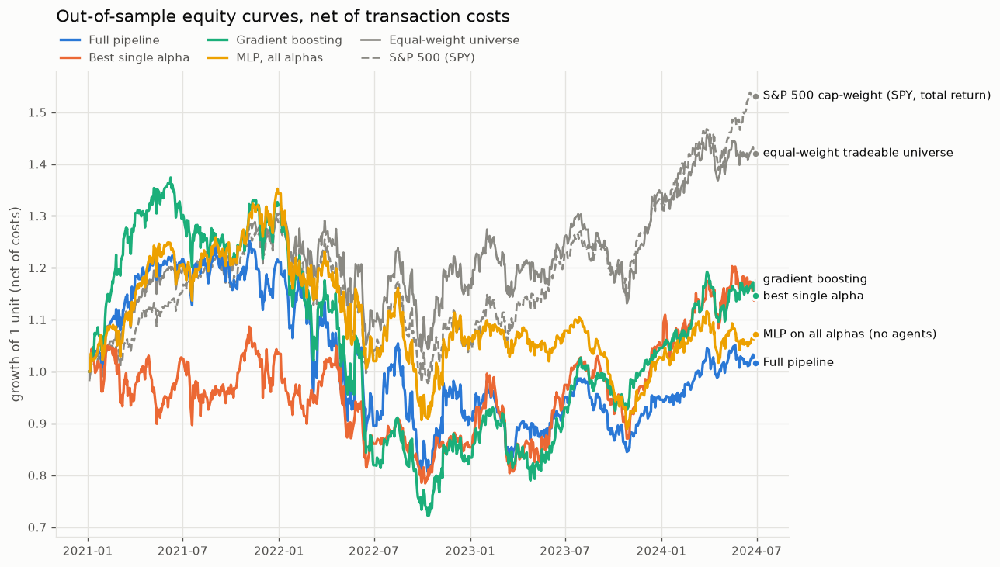
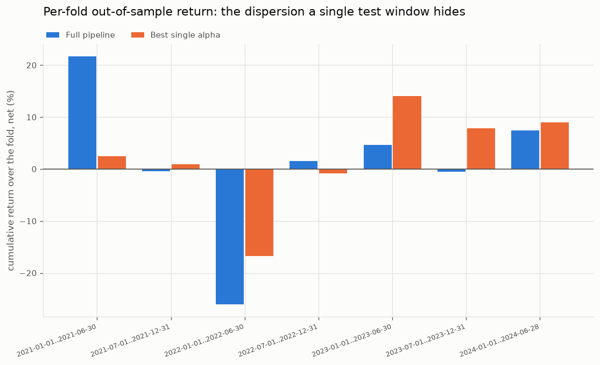

# Replication results: LLM-driven alpha framework on the S&P 500

Backtest of the three-stage framework from Kou et al., *Automate Strategy Finding with LLM in Quant Investment* (Findings of EMNLP 2025), adapted to US equities. Build details, data provenance and the leakage audit are in [ALPHA_LAB.md](../ALPHA_LAB.md).

## Run configuration

- Out-of-sample period: **2021-01-04 to 2024-06-28** across **7 walk-forward folds**
- Universe: point-in-time S&P 500, **81 usable alphas** of 92 in Appendix A.3
- Portfolio: top-13 / drop-5, equal weight, **10 bps per side** (cost + slippage), 1-day execution lag
- Agent weights: w_confidence **0.6**, w_risk **0.4**; IC horizon **5 days**

Every fold is reported. None is singled out.

### Fold geometry

| Fold | Train | Validation | Test |
|---|---|---|---|
| fold_1 | 2019-01-01..2020-06-30 | 2020-07-01..2020-12-31 | 2021-01-01..2021-06-30 |
| fold_2 | 2019-07-01..2020-12-31 | 2021-01-01..2021-06-30 | 2021-07-01..2021-12-31 |
| fold_3 | 2020-01-01..2021-06-30 | 2021-07-01..2021-12-31 | 2022-01-01..2022-06-30 |
| fold_4 | 2020-07-01..2021-12-31 | 2022-01-01..2022-06-30 | 2022-07-01..2022-12-31 |
| fold_5 | 2021-01-01..2022-06-30 | 2022-07-01..2022-12-31 | 2023-01-01..2023-06-30 |
| fold_6 | 2021-07-01..2022-12-31 | 2023-01-01..2023-06-30 | 2023-07-01..2023-12-31 |
| fold_7 | 2022-01-01..2023-06-30 | 2023-07-01..2023-12-31 | 2024-01-01..2024-06-28 |

## Headline: stitched out-of-sample performance, net of costs

| Strategy | Cum. return (net) | Ann. return | Ann. vol | Sharpe | Sortino | Calmar | Max DD |
|---|---|---|---|---|---|---|---|
| Full pipeline (CSA + RPA) | 1.66% | 0.47% | 23.16% | 0.05 | 0.07 | 0.01 | -36.03% |
| Ablation: no Confidence agent | 10.23% | 2.84% | 21.18% | 0.14 | 0.21 | 0.08 | -34.14% |
| Ablation: no Risk agent | 1.70% | 0.49% | 24.53% | 0.06 | 0.09 | 0.01 | -45.96% |
| Baseline: best single alpha | 14.48% | 3.96% | 21.86% | 0.20 | 0.29 | 0.14 | -27.80% |
| Baseline: gradient boosting | 14.66% | 4.01% | 22.12% | 0.20 | 0.28 | 0.08 | -47.48% |
| Baseline: MLP on all alphas (no agents) | 7.12% | 2.00% | 19.14% | 0.09 | 0.14 | 0.06 | -34.30% |
| Benchmark: S&P 500 cap-weight (SPY, total return) | 53.14% | 13.03% | 16.80% | 0.69 | 0.99 | 0.53 | -24.50% |
| Benchmark: S&P 500 equal-weight (RSP) | 36.49% | 9.35% | 16.59% | 0.50 | 0.74 | 0.44 | -21.38% |
| Benchmark: S&P 500 price index (^GSPC) | 45.38% | 11.35% | 16.80% | 0.60 | 0.86 | 0.45 | -25.43% |
| Benchmark: equal-weight tradeable universe | 42.07% | 10.62% | 16.88% | 0.56 | 0.84 | 0.50 | -21.03% |

The full pipeline returned **1.66% cumulative** over 2021-01-04 to 2024-06-28, against **42.07%** for an equal-weight hold of the same tradeable universe and **53.14%** for cap-weight S&P 500 total return.

## Costs are not a rounding error

| Strategy | Cum. return gross | Cum. return net | Sharpe gross | Sharpe net | Ann. turnover | Ann. cost drag |
|---|---|---|---|---|---|---|
| Full pipeline (CSA + RPA) | 44.19% | 1.66% | 0.48 | 0.05 | 50.2x | 10.04% |
| Ablation: no Confidence agent | 69.75% | 10.23% | 0.73 | 0.14 | 62.0x | 12.41% |
| Ablation: no Risk agent | 45.11% | 1.70% | 0.48 | 0.06 | 51.1x | 10.21% |
| Baseline: best single alpha | 29.82% | 14.48% | 0.36 | 0.20 | 18.1x | 3.61% |
| Baseline: gradient boosting | 75.16% | 14.66% | 0.75 | 0.20 | 60.9x | 12.18% |
| Baseline: MLP on all alphas (no agents) | 51.42% | 7.12% | 0.61 | 0.09 | 49.7x | 9.94% |

The paper models no transaction costs at all. On this universe the pipeline turns over roughly **19.9% of the book per day**, which at 10bps per side costs **10.04% a year**. Cumulative return falls from 44.19% gross to 1.66% net. Any comparison against the paper's headline number has to account for this before anything else.

## Per-fold results (full pipeline)

| Test window | Alphas | Cum. return (net) | Ann. return | Sharpe (net) | Sharpe (gross) | Max DD | Turnover/day |
|---|---|---|---|---|---|---|---|
| 2021-01-01..2021-06-30 | 8 | 21.67% | 48.97% | 2.42 | 3.08 | -3.78% | 21.2% |
| 2021-07-01..2021-12-31 | 8 | -0.45% | -0.89% | -0.07 | 0.42 | -10.63% | 17.8% |
| 2022-01-01..2022-06-30 | 8 | -26.08% | -45.88% | -1.40 | -1.10 | -26.89% | 23.7% |
| 2022-07-01..2022-12-31 | 8 | 1.50% | 3.00% | 0.18 | 0.60 | -24.03% | 25.3% |
| 2023-01-01..2023-06-30 | 8 | 4.60% | 9.57% | 0.50 | 0.92 | -15.15% | 14.8% |
| 2023-07-01..2023-12-31 | 8 | -0.52% | -1.03% | -0.15 | 0.70 | -14.43% | 23.2% |
| 2024-01-01..2024-06-28 | 8 | 7.49% | 15.81% | 1.13 | 1.71 | -5.36% | 13.5% |

**4 of 7 folds** were positive net of costs, with fold Sharpe ranging -1.40 to 2.42. Dispersion this wide across folds is the reason a single test window is not evidence.

## Direct comparison with the paper's reported S&P 500 results

The paper's Table 6 reports three SP500 test windows. Our rolling folds land on exactly those windows, so this is a like-for-like comparison of the same strategy design on the same index over the same dates, with the differences in universe construction, agent operationalisation and costs set out in [ALPHA_LAB.md](../ALPHA_LAB.md#deliberate-deviations-from-the-paper).

| Test window | Paper: cum. return | Ours: cum. (net) | Ours: cum. (gross) | Paper: max DD | Ours: max DD |
|---|---|---|---|---|---|
| 2021-01-01..2021-06-30 | 35.19% | 21.67% | 28.23% | -7.89% | -3.78% |
| 2022-01-01..2022-06-30 | 1.25% | -26.08% | -21.59% | -20.55% | -26.89% |
| 2023-01-01..2023-06-30 | 42.78% | 4.60% | 8.50% | -11.52% | -15.15% |

The paper's annualised figures in Table 6 are worth reading carefully on their own terms: a 59.03% half-year is reported as a 192.27% annual return, where compounding gives 153%. Cumulative return is the unambiguous column, so that is what is compared here.

## Ablation: what do the two agents contribute?

The paper's Tables 7 and 8 report that removing either agent degrades performance, with the confidence agent mattering more.

| Configuration | Cum. return (net) | Sharpe (net) | vs full |
|---|---|---|---|
| Full pipeline (CSA + RPA) | 1.66% | 0.05 | - |
| Ablation: no Confidence agent | 10.23% | 0.14 | +8.58 pp |
| Ablation: no Risk agent | 1.70% | 0.06 | +0.05 pp |
| Baseline: MLP on all alphas (no agents) | 7.12% | 0.09 | +5.47 pp |

## Benchmarks and simpler baselines

Beating the index in a rising market is a weak claim. The question is whether the pipeline beats the things you would try first, on the same universe, portfolio rule and costs.

| Strategy | Cum. return (net) | Sharpe (net) |
|---|---|---|
| Full pipeline (CSA + RPA) | 1.66% | 0.05 |
| Baseline: best single alpha | 14.48% | 0.20 |
| Baseline: gradient boosting | 14.66% | 0.20 |
| Baseline: MLP on all alphas (no agents) | 7.12% | 0.09 |
| Benchmark: equal-weight tradeable universe | 42.07% | 0.56 |
| Benchmark: S&P 500 equal-weight (RSP) | 36.49% | 0.50 |
| Benchmark: S&P 500 cap-weight (SPY, total return) | 53.14% | 0.69 |

## Statistical significance

Point estimates from one backtest are not evidence. HAC (Newey-West) standard errors correct for the autocorrelation in daily strategy returns; the confidence interval comes from a block bootstrap that resamples 21-day blocks, preserving that autocorrelation.

| Strategy | Mean daily return | HAC t-stat | HAC p | Sharpe | Bootstrap 95% CI | Excess vs EW universe (t) |
|---|---|---|---|---|---|---|
| Full pipeline (CSA + RPA) | 0.0125% | 0.26 | 0.794 | 0.05 | [-0.91, 0.95] | -1.43 |
| Ablation: no Confidence agent | 0.0200% | 0.49 | 0.626 | 0.14 | [-0.75, 1.01] | -1.20 |
| Ablation: no Risk agent | 0.0138% | 0.28 | 0.779 | 0.06 | [-0.96, 1.02] | -1.26 |
| Baseline: best single alpha | 0.0249% | 0.55 | 0.582 | 0.20 | [-0.71, 1.23] | -0.69 |
| Baseline: gradient boosting | 0.0253% | 0.53 | 0.596 | 0.20 | [-0.84, 1.28] | -0.85 |
| Baseline: MLP on all alphas (no agents) | 0.0151% | 0.41 | 0.680 | 0.09 | [-0.95, 1.02] | -1.76 |

For the full pipeline the mean daily return carries a HAC t-statistic of **0.26** (p = 0.794), and the bootstrap 95% interval for its Sharpe is **[-0.91, 0.95]**. Against an equal-weight hold of the same universe, the excess return t-statistic is **-1.43** (p = 0.154).

## Is it alpha, or a sector and beta tilt?

A concentrated 13-stock book can look like alpha while simply being long beta or long one sector. Strategy returns are regressed on the market and then on the market plus equal-weight GICS sector portfolios, with HAC errors. The intercept is what the boring explanations do not account for.

| Strategy | CAPM alpha (ann.) | CAPM t | Market beta | + Sector alpha (ann.) | Sector-model t | Model R² |
|---|---|---|---|---|---|---|
| Full pipeline (CSA + RPA) | -12.07% | -2.06 | 1.17 | -9.75% | -2.06 | 0.81 |
| Ablation: no Confidence agent | -8.76% | -1.64 | 1.04 | -6.95% | -1.36 | 0.77 |
| Ablation: no Risk agent | -12.47% | -2.10 | 1.23 | -9.59% | -1.85 | 0.82 |
| Baseline: best single alpha | -6.46% | -0.85 | 0.95 | -6.21% | -0.86 | 0.58 |
| Baseline: gradient boosting | -8.24% | -1.24 | 1.10 | -7.08% | -1.35 | 0.81 |
| Baseline: MLP on all alphas (no agents) | -9.03% | -1.95 | 0.97 | -7.02% | -1.79 | 0.83 |

The full pipeline's market beta is **1.17**. Its CAPM alpha is **-12.07%** a year (t = -2.06); adding sector factors moves that to **-9.75%** (t = -2.06).

## Sensitivity to the agent weights (paper's Table 9)

The paper reports 0.6/0.4 as clearly best, with a strikingly non-monotonic ladder around it (Sharpe 8.10 at 1.0/0.0, -2.68 at 0.8/0.2, 11.39 at 0.6/0.4, -5.10 at 0.5/0.5). Re-run on this universe:

| w_confidence | w_risk | Cum. return (net) | Ann. return | Sharpe (net) | Max DD |
|---|---|---|---|---|---|
| 1.0 | 0.0 | -35.01% | -11.65% | -0.48 | -45.96% |
| 0.8 | 0.2 | -9.31% | -2.77% | -0.08 | -43.64% |
| 0.6 **(paper's choice)** | 0.4 | 1.61% | 0.46% | 0.05 | -36.25% |
| 0.5 | 0.5 | 11.56% | 3.19% | 0.17 | -34.44% |
| 0.4 | 0.6 | -0.41% | -0.12% | 0.00 | -34.21% |
| 0.2 | 0.8 | 22.13% | 5.91% | 0.28 | -31.54% |
| 0.0 | 1.0 | -4.26% | -1.24% | -0.04 | -32.43% |

Best ratio here is **0.2/0.8** (net Sharpe 0.28), not the paper's 0.6/0.4. The whole ladder spans -0.48 to 0.28.

Read that spread against the bootstrap intervals above, which are roughly a full Sharpe point wide. Every cell in this ladder sits inside the noise band of every other cell, so the ordering carries no information. The paper reports the same sweep with Sharpe ratios from -8.04 to 11.39 and treats the ranking as meaningful; a ladder that swings that violently on a weight change is better read as evidence of an unstable objective than as a tuning result.

## Does this hold up?

### The short answer

- Over 7 out-of-sample folds the full pipeline returned **1.66%** net of costs against **42.07%** for simply holding the same universe equal-weighted, so it **did not** beat that benchmark.
- Its mean daily return is **not statistically distinguishable from zero** under a HAC-corrected test (t = 0.26, p = 0.794), and the block-bootstrap interval for its Sharpe spans zero at [-0.91, 0.95].
- Against an equal-weight hold of the same universe the excess return carries t = -1.43 (p = 0.154), which is **not** significant at the 5% level.
- Once market beta and eleven sector portfolios are regressed out, the unexplained annual alpha is **-9.75%** (t = -2.06), which is significantly **negative**. This is a stronger statement than 'no alpha': after accounting for market beta and sector exposure, the strategy destroyed value at a rate that passes conventional significance. The signal is not merely absent, it is adverse.
- Its market beta is **1.17**, so it carried *more* market risk than the index while delivering less return.

### Did the pipeline beat the simple things?

| Comparison | Result |
|---|---|
| vs. equal-weight universe | pipeline behind (1.66% vs 42.07%) |
| vs. cap-weight S&P 500 | pipeline behind (1.66% vs 53.14%) |
| vs. best single alpha | pipeline behind (1.66% vs 14.48%) |
| vs. gradient boosting on the same features | pipeline behind (1.66% vs 14.66%) |
| vs. MLP on all alphas, no agent layer | pipeline behind (1.66% vs 7.12%) |

The best-single-alpha row is the one that matters most. A three-stage pipeline that cannot beat one formula run through the identical portfolio rule is not earning its complexity on this data.

The agent layer is also not paying for itself here: feeding every usable alpha straight to the network did better than selecting with CSA and RPA first.

### Where our numbers diverge from the paper's, and why

The paper reports 53.17% on SSE50 for 2023 and 42.78% on SP500 for H1 2023. We do not reproduce anything of that size. The differences are structural, not a matter of tuning:

1. **Transaction costs.** The paper models none, at its own stated ~38% daily turnover. Here that costs **10.04% a year**, taking cumulative return from 44.19% gross to 1.66% net. This single difference is worth more than most of the others combined.
2. **Execution timing.** We execute a signal one session after the close it was computed from. The paper is silent on this, and same-bar execution is worth a great deal at daily rebalancing frequency.
3. **Agent operationalisation.** The paper defines confidence and risk only as `E[IC]` and `f_risk(...)`. We had to invent concrete definitions. Ours are mechanical and can only see data available at the scoring date; the paper's were produced by an LLM that, per Appendix A.7, was shown *test-period factor performance* and whose training data covers the 2023 test window.
4. **Universe.** Point-in-time S&P 500 rather than SSE50. A 50-stock large-cap Chinese index in 2023 is a different opportunity set from ~450 US large caps, and cross-sectional strategies are highly sensitive to breadth.
5. **No multimodal inputs.** No audio, video, chart images or news sentiment. This is a real difference from the paper's design, though the paper provides no ablation isolating what those inputs contribute.
6. **Survivorship.** Our universe is point-in-time, but 110 delisted tickers have no price history. Whether the paper's SSE50 constituent set was point-in-time is not stated.

### What I would still not trust here

- **The delisted-ticker hole.** 16.8% of ever-members cannot be priced. Direction of bias is ambiguous (acquisitions remove winners, failures remove losers) but the magnitude is not negligible.
- **Sector labels are not point-in-time.** The attribution uses each ticker's most recently known GICS sector for all history. Sector reclassifications are rare but not zero.
- **The weight sweep is a selection surface.** Reporting the best cell of a seven-row ladder is itself a form of overfitting, which is exactly why the whole ladder is printed rather than only the winner.
- **One universe, one country, five and a half years.** Nothing here says anything about whether the design works elsewhere.
- **Alpha decay is not modelled.** Factors that worked in 2021 need not work in 2024, and the walk-forward design measures that but does not correct for it.

## Which alphas the agents actually picked

| Alpha | Category | Folds selected | Mean IC at selection |
|---|---|---|---|
| `distance_from_high` | mean_reversion | 3 | 0.0040 |
| `dividends_growth` | growth | 3 | 0.0012 |
| `adx_momentum` | momentum | 2 | 0.0294 |
| `atr_technical` | technical | 2 | 0.0065 |
| `bollinger_bands` | technical | 2 | -0.0051 |
| `cash_conversion_cycle` | quality | 2 | 0.0026 |
| `cash_flow_yield` | fundamental | 2 | 0.0269 |
| `dividend_yield` | fundamental | 2 | -0.0366 |
| `net_profit_margin` | quality | 2 | 0.0015 |
| `price_to_sales` | liquidity | 2 | -0.0306 |
| `sales_to_price` | fundamental | 2 | 0.0306 |
| `std_dev` | volatility | 2 | -0.0051 |
| `ulcer_index` | volatility | 2 | 0.0091 |
| `asset_growth` | growth | 1 | 0.0264 |
| `asset_turnover` | quality | 1 | 0.0220 |
| `atr` | volatility | 1 | 0.0133 |
| `atr_momentum` | momentum | 1 | -0.0226 |
| `avg_trading_volume` | liquidity | 1 | -0.0132 |
| `bollinger_position` | mean_reversion | 1 | 0.0035 |
| `cash_flow_growth` | growth | 1 | 0.0292 |
| `chaikin_volatility` | volatility | 1 | -0.0097 |
| `distance_from_low` | mean_reversion | 1 | -0.0386 |
| `dpo` | momentum | 1 | -0.0302 |
| `earnings_yield` | fundamental | 1 | 0.0103 |
| `ebitda_growth` | growth | 1 | -0.0455 |
| `ema_reversion` | mean_reversion | 1 | 0.0349 |
| `ev_to_ebitda` | liquidity | 1 | 0.0492 |
| `high_low_spread` | liquidity | 1 | -0.0269 |
| `interest_coverage` | quality | 1 | 0.0312 |
| `ma_reversion` | mean_reversion | 1 | 0.0245 |
| `macd` | technical | 1 | -0.0358 |
| `macd_momentum` | momentum | 1 | 0.0161 |
| `moving_average` | technical | 1 | 0.0210 |
| `operating_profit_margin` | quality | 1 | 0.0108 |
| `price_momentum` | momentum | 1 | -0.0193 |
| `retained_earnings_growth` | growth | 1 | 0.0168 |
| `return_on_equity` | liquidity | 1 | 0.0129 |
| `rsi` | technical | 1 | 0.0206 |
| `rsi_momentum` | momentum | 1 | -0.0280 |
| `turnover_rate` | liquidity | 1 | 0.0233 |
| `volatility_ratio` | volatility | 1 | 0.0128 |
